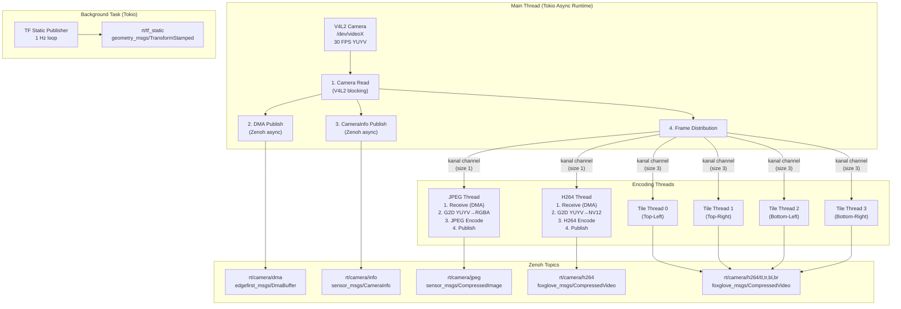
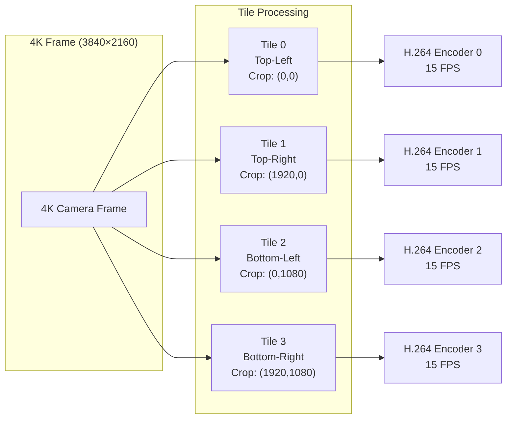
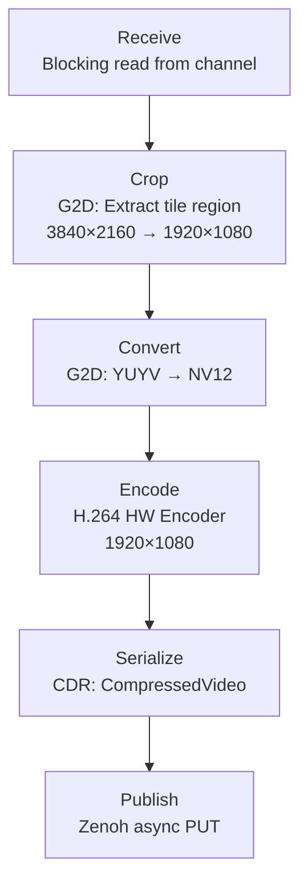
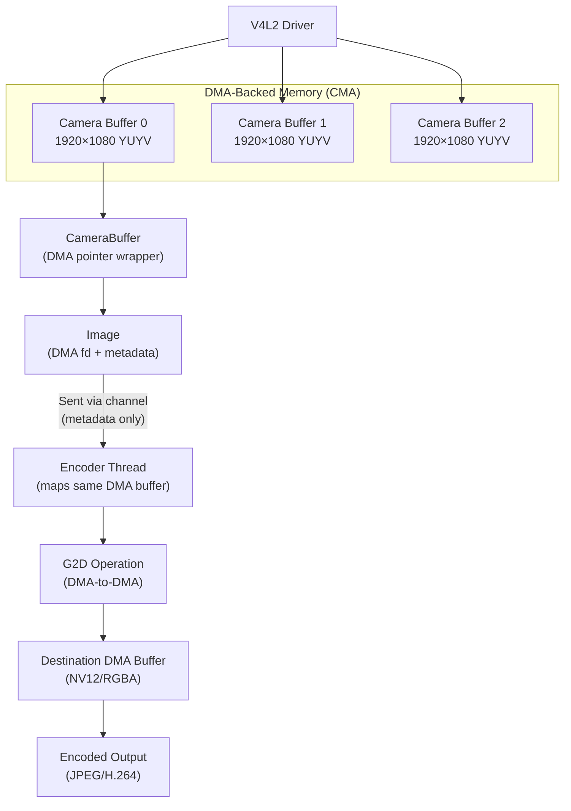

# EdgeFirst Camera Node - Architecture

**Technical architecture documentation for developers**

This document describes the internal architecture of the EdgeFirst Camera Node, focusing on thread models, data flow patterns, and system design decisions. For user-facing documentation, see [README.md](README.md).

---

## Table of Contents

1. [System Overview](#system-overview)
2. [Thread Architecture](#thread-architecture)
3. [Data Flow](#data-flow)
4. [Message Formats](#message-formats)
5. [Hardware Integration](#hardware-integration)
6. [Instrumentation and Profiling](#instrumentation-and-profiling)
7. [References](#references)

---

## System Overview

The EdgeFirst Camera Node is a multi-threaded, asynchronous application built on the Tokio async runtime. It implements a **producer-consumer pattern** where the main thread captures camera frames and distributes them to specialized encoding threads for parallel processing.

### Architecture Diagram



### Key Architectural Properties

- **Lock-Free Communication**: Threads communicate via bounded SPSC (Single Producer, Single Consumer) channels using the `kanal` crate
- **Zero-Copy DMA**: Camera buffers are DMA-backed; only metadata is passed between threads
- **Backpressure Handling**: Bounded channels with size 1-3; older frames dropped if consumer is slow
- **Async Main Thread**: Tokio runtime for Zenoh publishing (I/O-bound operations)
- **Dedicated Encoder Threads**: Synchronous encoding threads with their own Tokio runtimes for publishing
- **Parallel Processing**: Up to 6 encoding threads running simultaneously (1 JPEG + 1 H264 + 4 tiles)

---

## Thread Architecture

### Main Thread (Tokio Multi-Threaded Runtime)

**Responsibilities:**

- Camera frame capture (V4L2 blocking read)
- DMA buffer publishing (Zenoh async)
- CameraInfo publishing (Zenoh async)
- Frame distribution to encoder threads
- FPS monitoring and warnings

**Execution Model:**

The main thread executes within a Tokio async runtime (`#[tokio::main]`) and performs the following operations:

1. **Initialization:** Open V4L2 camera device with configured resolution and format
2. **Channel Creation:** Create bounded channels (size 1) for communication with encoder threads
3. **Thread Spawning:** Start dedicated encoder threads (JPEG, H264, TensorFlow)
4. **Main Capture Loop:**
   - **BLOCKING:** Read frame from camera using V4L2 API
   - **ASYNC:** Publish DMA buffer metadata to Zenoh
   - **ASYNC:** Publish camera calibration info to Zenoh
   - **NON-BLOCKING:** Send frames to encoder threads via channels
        jpeg_tx.try_send(Image::from_camera(&camera_buffer));
        h264_tx.try_send(Image::from_camera(&camera_buffer));

        // If channels full, frames are dropped (backpressure)
    }
}
```

**Why Async Main Thread?**

- **Zenoh is async-first**: Efficient I/O multiplexing for network publishing
- **Non-blocking publish**: Camera read loop doesn't wait for network I/O
- **Concurrent publishing**: Multiple Zenoh PUT operations in flight simultaneously

**Thread Count:** 1 main thread (Tokio work-stealing thread pool: 4-8 worker threads for async tasks)

---

### JPEG Encoder Thread

**Lifecycle:**

The JPEG encoder thread is spawned using `thread::Builder` with a named thread. Each encoder thread creates its own dedicated single-threaded Tokio runtime to handle async Zenoh publishing independently from the main thread's runtime.

See `src/main.rs` for thread creation and `jpeg_task()` implementation.

**Processing Pipeline:**

```
[Receive]     Blocking read from kanal channel
   ↓          (blocks until frame available or shutdown)
[Convert]     G2D hardware: YUYV → RGBA
   ↓          DMA-to-DMA conversion
[Encode]      turbojpeg software encoding
   ↓          RGBA → JPEG
[Serialize]   CDR: sensor_msgs/CompressedImage
   ↓
[Publish]     Zenoh async PUT
   ↓          (async, batched with Tokio)
```

**Why Dedicated Thread?**

- **CPU-bound work**: JPEG encoding is computationally expensive
- **Isolated from main loop**: Encoding latency doesn't block camera capture
- **Own Tokio runtime**: Independent async context for Zenoh publishing

**Thread Count:** 1 (when `--jpeg` flag enabled)

---

### H264 Encoder Thread

**Processing Pipeline:**

```
[Receive]     Blocking read from kanal channel
   ↓
[Convert]     G2D hardware: YUYV → NV12
   ↓          DMA-to-DMA conversion
[Resize]      G2D hardware: Optional scaling
   ↓          (if stream_size != camera_size)
[Encode]      H264 hardware encoder (V4L2 M2M)
   ↓          NV12 → H264 NAL units
[Serialize]   CDR: foxglove_msgs/CompressedVideo
   ↓
[Publish]     Zenoh async PUT
   ↓
```

**Thread Count:** 1 (when `--h264` flag enabled)

---

### H264 Tile Encoder Threads (4K Mode)

**Tile Distribution:**



Each thread:

- Independent kanal channel (size 3)
- Independent Zenoh topic
- Independent H264 encoder instance
- FPS-limited (default 15 FPS vs camera 30 FPS)

**Per-Tile Processing Pipeline:**



**FPS Throttling:**

- Tiles encode at lower FPS (default 15) than camera capture (30)
- **Why?** Reduces H264 compression artifacts at 4K resolution
- **How?** Frame skipping in receive loop based on timestamp

**Thread Count:** 4 (when `--h264-tiles` flag enabled or camera resolution > 1080p)

---

### TF Static Publisher (Background Task)

**Execution:**

The TF static publisher runs as a detached Tokio task spawned from the main async runtime.

**Loop:**

```
[Sleep] 1 second
   ↓
[Publish] TransformStamped to rt/tf_static
   ↓
[Repeat]
```

**Purpose:**

- Publishes static transform from `camera_link` to `camera_optical_frame`
- ROS2 convention: Camera frame needs transform for visualization (RViz, Foxglove)
- Published continuously at 1 Hz for late-joining subscribers

**Thread Count:** Runs on Tokio thread pool (not a dedicated thread)

---

## Data Flow

### Channel-Based Communication

The camera node uses **bounded SPSC channels** from the `kanal` crate for inter-thread communication with configurable capacity.

**Channel Sizes:**

- **JPEG/H264 channels**: Capacity 1 (drop old frames if encoding is slow)
- **Tile channels**: Capacity 3 (more tolerance for parallel encoding)

**Send Logic (Main Thread):**

The main thread uses non-blocking `try_send()` on bounded channels:
- **Success:** Frame sent to encoder thread
- **Full:** Frame dropped with warning logged (encoder is slow)
- **Closed:** Error logged (encoder thread exited)

This prevents the camera capture loop from blocking when encoders can't keep up.

**Receive Logic (Encoder Threads):**

Encoder threads use blocking `recv()` on channels, sleeping until frames are available. This approach minimizes CPU usage when the camera is idle.

### Backpressure Strategy

**Problem:** Encoder threads can't keep up with 30 FPS camera rate

**Solution:** **Drop frames** (non-blocking send with bounded channels)

**Alternatives Considered:**

- ❌ **Unbounded channels**: Would lead to unbounded memory growth and latency
- ❌ **Blocking send**: Would stall camera capture if encoder is slow
- ✅ **Bounded + try_send**: Camera continues at full FPS, encoders get best-effort

**Monitoring:**

The main thread logs warnings when the measured FPS falls below 90% of the target FPS, indicating performance issues.

---

### Zero-Copy DMA Buffer Sharing

**Data Flow:**



**Key Point:** The actual pixel data never leaves DMA memory. Only metadata (file descriptor, dimensions, format) is passed between threads.

---

## Message Formats

All messages are serialized using **ROS2 CDR (Common Data Representation)** for compatibility with ROS2 ecosystems.

### DMA Buffer Message

```rust
// edgefirst_msgs/DmaBuffer
pub struct DmaBuf {
    pub header: Header,           // ROS2 standard header (timestamp, frame_id)
    pub fd: u32,                  // DMA file descriptor
    pub offset: u64,              // Offset into DMA buffer
    pub stride: u32,              // Row stride (bytes per line)
    pub width: u32,               // Image width
    pub height: u32,              // Image height
    pub size: u64,                // Total buffer size
    pub format: String,           // Pixel format ("YUYV", "NV12", etc.)
    pub src_pid: u32,             // Source process ID (for SCM_RIGHTS)
}
```

**Consumer Workflow:**

Downstream vision models consume DMA buffers by:

1. Extracting file descriptor from Zenoh message metadata
2. Memory-mapping the DMA buffer using `mmap()` with `MAP_SHARED`
3. Creating image view with dimensions, stride, and format from message
4. Processing image data (inference, display, recording)
5. Unmapping buffer and closing file descriptor

This zero-copy approach allows multiple consumers to access the same physical memory without data duplication. File descriptor passing uses Zenoh's metadata capabilities.

### Camera Info Message

```rust
// sensor_msgs/CameraInfo
pub struct CameraInfo {
    pub header: Header,
    pub height: u32,
    pub width: u32,
    pub distortion_model: String,  // "plumb_bob", "rational_polynomial", etc.
    pub d: Vec<f64>,               // Distortion coefficients
    pub k: [f64; 9],               // Intrinsic camera matrix (3x3)
    pub r: [f64; 9],               // Rectification matrix (3x3)
    pub p: [f64; 12],              // Projection matrix (3x4)
    pub binning_x: u32,
    pub binning_y: u32,
    pub roi: RegionOfInterest,
}
```

**Published Rate:** 30 Hz (same as camera FPS)

**Purpose:**

- Camera calibration for 3D reconstruction
- Undistortion for vision algorithms
- ROS2 ecosystem compatibility

### Compressed Image Message (JPEG)

```rust
// sensor_msgs/CompressedImage
pub struct CompressedImage {
    pub header: Header,
    pub format: String,           // "jpeg", "png", etc.
    pub data: Vec<u8>,            // Compressed image bytes
}
```

**Encoding:**

- Format: JPEG (turbojpeg library with SIMD optimizations)
- Quality: Configurable via turbojpeg (default: 95%)
- Color Space: RGB (from YUYV via G2D)

### Compressed Video Message (H264)

```rust
// foxglove_msgs/CompressedVideo
pub struct FoxgloveCompressedVideo {
    pub timestamp: Time,          // Frame capture time
    pub frame_id: String,         // "camera_optical_frame"
    pub data: Vec<u8>,            // H264 NAL units
    pub format: String,           // "h264"
}
```

**Encoding:**

- Codec: H.264 (hardware encoder via V4L2 M2M)
- Profile: High Profile
- Bitrate: Configurable (auto, 5/25/50/100 Mbps)
- GOP: 30 frames (1 second at 30 FPS)

---

## Hardware Integration

### V4L2 (Video for Linux 2) - Camera Interface

**Initialization:**

The camera is initialized using the `videostream` crate's builder pattern:
- Device path (typically `/dev/video0`)
- Resolution (e.g., 1920×1080 or 3840×2160)
- Pixel format (YUYV for MIPI cameras)
- Mirror settings (horizontal, vertical, or both)
- Stream start (V4L2 `VIDIOC_STREAMON` ioctl)

**Frame Capture:**

Frames are captured using blocking reads that dequeue V4L2 buffers (`VIDIOC_DQBUF`). Each buffer provides:
- DMA-backed memory pointer
- Hardware timestamp from camera driver
- Sequential frame number

**Buffer Management:**

- **Type:** V4L2_MEMORY_MMAP (memory-mapped)
- **Queue Size:** 4 buffers (driver default)
- **Dequeue/Enqueue:** Handled by `videostream` library

### NXP G2D - Hardware Accelerator

**Purpose:** Format conversion, scaling, cropping, rotation

**API:**

The G2D hardware accelerator is accessed via `g2d-sys` FFI bindings:
- Open device at `/dev/galcore`
- Create surfaces from DMA file descriptors with format specifications
- Perform blit operations (format conversion, scaling, rotation)
- Synchronize with `finish()` to wait for completion

See `src/image.rs` for complete G2D integration.

**Operations:**

- **Format Conversion:** YUYV → NV12, RGB, RGBA
- **Scaling:** Arbitrary resolution changes (e.g., 4K → 1080p)
- **Cropping:** Extract rectangular regions for tiling
- **Rotation:** 90°, 180°, 270° transformations
- **Mirroring:** Horizontal, vertical, or both axes

**Performance:** Hardware acceleration provides significant speedup over CPU-based implementations. Actual timing depends on resolution, operation type, and system load.

### H.264 Hardware Encoder (Hantro)

**V4L2 M2M (Memory-to-Memory) Interface:**

The H264 encoder is accessed via V4L2 memory-to-memory interface at `/dev/mxc-hantro-h1`:
- Configure output format (resolution, pixel format NV12)
- Set encoding parameters (bitrate in bps, GOP size)
- Encode frames by submitting NV12 buffers
- Receive H264 NAL units

See `src/video.rs` for complete encoder implementation.

**Specifications:**

- **Max Resolution:** 1920×1080 (requires tiling for 4K sources)
- **Max FPS:** 60 FPS @ 1080p
- **Bitrate Range:** 1-100 Mbps
- **Profiles:** Baseline, Main, High
- **Latency:** Implementation-dependent, varies with resolution and system load

---

## Instrumentation and Profiling

The camera node uses the Tokio tracing ecosystem for observability and the Tracy profiler for performance analysis.

### Tracing Architecture

**Tracing Layers:**

The application uses `tracing-subscriber` with multiple layers configured in `src/main.rs`:
- Registry base for span context
- stdout_log for console output
- journald for systemd journal integration
- tokio-console for async task monitoring (optional, `--tokio-console` flag)
- Tracy profiler integration (optional, `--tracy` flag)

**Layer Details:**

1. **stdout_log** - Console output with pretty formatting
   - Filter: `RUST_LOG` environment variable (default: INFO)
   - Use: Development and debugging

2. **journald** - systemd journal integration
   - Filter: `RUST_LOG` environment variable (default: INFO)
   - Use: Production deployment, queryable with `journalctl`

3. **console** - Tokio async task monitoring (optional, `--tokio-console` flag)
   - Requires: `tokio-console` binary running
   - Use: Debugging async task issues, deadlocks, blocking

4. **tracy** - Tracy profiler integration (optional, `--tracy` flag)
   - Requires: Tracy profiler GUI connected
   - Use: Frame timing, performance analysis, CPU profiling

### Tracy Integration

**Features Available:**

The camera node has Tracy instrumentation enabled by default (via `default = ["tracy"]` feature).

**Tracy Markers:**

1. **Frame Markers:** Track frame completion for main camera loop, H264 encoding, JPEG encoding, and tile encoding pipelines

2. **Performance Plots:** Monitor runtime metrics including FPS, JPEG output size, and frame timing

3. **Span Instrumentation:** Major functions use `#[instrument]` attribute to create Tracy zones automatically, providing hierarchical timing information

See `src/main.rs`, `src/image.rs`, and `src/video.rs` for instrumentation placement.

**Advanced Profiling:**

When built with the `profiling` feature, additional instrumentation is available:

- **Memory profiling**: Global allocator tracking
- **System-level tracing**: CPU sampling, context switches
- **Thread sampling**: Statistical profiling

See `README.md` for build instructions with profiling enabled.

### Instrumentation Points

**Main Thread:**
- Camera frame capture timing
- DMA publish operations
- CameraInfo publish operations
- Frame distribution to encoder channels
- FPS calculation and monitoring

**Encoder Threads:**
- Frame receive timing
- G2D conversion operations
- JPEG/H264 encoding duration
- Message serialization
- Zenoh publish operations

**Span Hierarchy Example:**

```
main
├── camera_read
├── dma_publish
├── info_publish
└── frame_distribution
    ├── jpeg_task
    │   ├── g2d_convert
    │   ├── jpeg_encode
    │   └── jpeg_publish
    └── h264_task
        ├── g2d_convert
        ├── h264_encode
        └── h264_publish
```

Each span appears as a zone in Tracy with timing information.

---

## References

**Rust Crates:**

- [tokio](https://tokio.rs/) - Async runtime
- [zenoh](https://zenoh.io/) - Pub/sub middleware
- [kanal](https://github.com/fereidani/kanal) - Fast MPMC channels
- [videostream](https://github.com/EdgeFirstAI/videostream) - V4L2 camera interface

**Hardware Documentation:**

- [NXP i.MX8M Plus Reference Manual](https://www.nxp.com/docs/en/reference-manual/IMX8MPRM.pdf)
- [V4L2 API Specification](https://www.kernel.org/doc/html/latest/userspace-api/media/v4l/v4l2.html)

**ROS2 Standards:**

- [ROS2 CDR Serialization](https://design.ros2.org/articles/generated_interfaces_cpp.html)
- [sensor_msgs/CameraInfo](https://docs.ros2.org/latest/api/sensor_msgs/msg/CameraInfo.html)
- [sensor_msgs/CompressedImage](https://docs.ros2.org/latest/api/sensor_msgs/msg/CompressedImage.html)
