# EdgeFirst Camera Node

**Production-ready ROS2-compatible camera publisher with zero-copy DMA, hardware-accelerated encoding, and EdgeFirst Perception integration**

[](LICENSE)
[](https://www.rust-lang.org/)
[]()

---

## Overview

The EdgeFirst Camera Node is a high-performance camera service designed for edge AI perception systems. It interfaces directly with camera hardware through V4L2, provides zero-copy DMA buffer access for ultra-low latency pipelines, and publishes ROS2-compatible messages over Zenoh for seamless integration with robotics and vision ecosystems.

**Key Features:**

- 🎥 **ROS2 Compatibility** - Standard `sensor_msgs` interfaces for drop-in integration
- ⚡ **Zero-Copy DMA** - Direct memory access for latency-critical vision pipelines
- 🚀 **Hardware Acceleration** - NXP G2D format conversion and H.264 encoding
- 📦 **Multi-Format Output** - Raw DMA, JPEG, and H.264 streams from single capture
- 🔧 **Flexible Transport** - Native Zenoh with optional ROS2 bridge compatibility
- 📊 **Production Ready** - Tracy profiling, journald logging, comprehensive error handling
- 🎬 **4K Support** - Automatic tiling for high-resolution cameras

---

## EdgeFirst Perception Ecosystem

The EdgeFirst Camera Node is the **sensor interface layer** of the EdgeFirst Perception Middleware—a modular software stack for edge AI vision systems.

### Architecture Context

```mermaid
graph LR
    subgraph "Sensor Inputs"
        Camera["📷 Camera Service<br/>(THIS REPO)"]
        Radar["📡 Radar"]
        LiDAR["🔬 LiDAR"]
        IMU["⚖️ IMU"]
    end
    
    subgraph "EdgeFirst Perception Middleware"
        Zenoh["Zenoh Messaging<br/>(ROS2 CDR)"]
    end
    
    subgraph "Outputs & Applications"
        Vision["🤖 Vision Models"]
        Fusion["🔗 Fusion Models"]
        Recording["💾 Recording<br/>(MCAP)"]
        WebUI["🌐 Web UI<br/>(HTTPS)"]
    end
    
    Camera --> Zenoh
    Radar --> Zenoh
    LiDAR --> Zenoh
    IMU --> Zenoh
    
    Zenoh --> Vision
    Zenoh --> Fusion
    Zenoh --> Recording
    Zenoh --> WebUI
    
    style Camera fill:#f96,stroke:#333,stroke-width:3px
```



**What the Camera Node Does:**

- **Captures** frames from hardware cameras (MIPI CSI-2, USB UVC)
- **Processes** frames with hardware-accelerated format conversion and scaling
- **Encodes** video streams (JPEG for visualization, H.264 for recording)
- **Publishes** to Zenoh topics using ROS2 message formats
- **Provides** zero-copy DMA access for low-latency vision model inference

**Integration Points:**

- **Vision Models**: Consume raw DMA buffers for real-time object detection, classification, segmentation
- **Fusion Models**: Combine camera data with radar/LiDAR for multi-modal perception
- **Recording**: MCAP format recording for dataset collection and replay
- **Web UI**: Live JPEG/H.264 streaming for monitoring and debugging
- **Custom Applications**: ROS2-compatible message access via zenoh-bridge-dds

**Learn More:** [EdgeFirst Perception Documentation](https://doc.edgefirst.ai/test/perception/)

---

## Quick Start

### Prerequisites

**Hardware:**

- NXP i.MX8M Plus based platform (Maivin, Raivin) or compatible ARM64 device
- Camera: MIPI CSI-2 or USB UVC camera
- Minimum: 2GB RAM, quad-core ARM Cortex-A53

**Software:**

- Linux kernel 5.10+ with V4L2 support
- Rust 1.90.0 or later (for building from source)
- OR: Pre-built binaries from [GitHub Releases](https://github.com/EdgeFirstAI/camera/releases)

### Installation

**Option 1: Pre-built Binary (Recommended)**

```bash
# Download latest release for ARM64
wget https://github.com/EdgeFirstAI/camera/releases/latest/download/edgefirst-camera-linux-aarch64

# Make executable
chmod +x edgefirst-camera-linux-aarch64

# Run with default settings
./edgefirst-camera-linux-aarch64 --jpeg --h264
```

**Option 2: Build from Source**

```bash
# Clone repository
git clone https://github.com/EdgeFirstAI/camera.git
cd camera

# Build release binary
cargo build --release

# Run
./target/release/edgefirst-camera --jpeg --h264
```

**Option 3: Cross-Compile for ARM64**

```bash
# Add ARM64 target
rustup target add aarch64-unknown-linux-gnu

# Install cross-compilation toolchain
# (Debian/Ubuntu)
sudo apt-get install gcc-aarch64-linux-gnu

# Build for ARM64
cargo build --release --target aarch64-unknown-linux-gnu

# Binary at: target/aarch64-unknown-linux-gnu/release/edgefirst-camera
```

### Basic Usage

**Single Camera with JPEG and H.264 Streams:**

```bash
edgefirst-camera \
  --camera /dev/video0 \
  --camera-size 1920 1080 \
  --jpeg \
  --h264
```

**4K Camera with Automatic Tiling:**

```bash
# Automatically splits 4K into 4x 1080p H.264 tiles
edgefirst-camera \
  --camera /dev/video0 \
  --camera-size 3840 2160 \
  --h264-tiles
```

**Zero-Copy DMA for Vision Models:**

```bash
# Publishes raw DMA buffers on rt/camera/dma
# Consume these in your vision model for lowest latency
edgefirst-camera --camera /dev/video0
```

**Custom Topics and Configuration:**

```bash
edgefirst-camera \
  --camera /dev/video1 \
  --dma-topic rt/front_camera/dma \
  --jpeg-topic rt/front_camera/jpeg \
  --h264-topic rt/front_camera/h264 \
  --mirror both \
  --stream-size 640 480
```

---

## Key Capabilities

### ROS2 Message Compatibility

The camera node publishes standard ROS2 message types using CDR serialization, ensuring seamless integration with existing ROS2 ecosystems:

| Topic (default) | Message Type | Description |
|----------------|--------------|-------------|
| `rt/camera/dma` | `edgefirst_msgs/DmaBuffer` | Zero-copy DMA buffer metadata |
| `rt/camera/info` | `sensor_msgs/CameraInfo` | Camera calibration and metadata |
| `rt/camera/jpeg` | `sensor_msgs/CompressedImage` | JPEG-compressed frames |
| `rt/camera/h264` | `foxglove_msgs/CompressedVideo` | H.264 video stream |
| `rt/camera/h264/tl` | `foxglove_msgs/CompressedVideo` | 4K tile: top-left (1080p) |
| `rt/camera/h264/tr` | `foxglove_msgs/CompressedVideo` | 4K tile: top-right (1080p) |
| `rt/camera/h264/bl` | `foxglove_msgs/CompressedVideo` | 4K tile: bottom-left (1080p) |
| `rt/camera/h264/br` | `foxglove_msgs/CompressedVideo` | 4K tile: bottom-right (1080p) |
| `rt/tf_static` | `geometry_msgs/TransformStamped` | Camera frame transform |

**ROS2 Bridge Integration:**

```bash
# Start camera node
edgefirst-camera --jpeg --h264 &

# Start zenoh-bridge-dds for ROS2 compatibility
zenoh-bridge-dds

# View with ROS2 tools
ros2 topic list
ros2 topic echo /rt/camera/info
rqt_image_view  # View JPEG stream
```

### Zero-Copy DMA Architecture

For latency-critical vision pipelines, the camera node provides direct DMA buffer access:

```rust
// Vision model consuming DMA buffers (pseudo-code)
subscriber.on_message(|msg: DmaBuf| {
    // msg.fd: DMA file descriptor
    // msg.width, msg.height, msg.format: Buffer metadata
    // msg.offset, msg.stride: Memory layout

    // Map DMA buffer (zero-copy, no memory allocation)
    let frame = map_dma_buffer(msg.fd, msg.offset, msg.size)?;

    // Run inference directly on DMA buffer
    model.infer(frame)?;

    // No buffer copy, no deserialization overhead
});
```

**Performance Benefits:**

- **5-10ms latency** vs 50-100ms with traditional copy-based approaches
- **Zero memory copies** from camera to inference
- **Reduced CPU load** - no memcpy overhead
- **Lower memory bandwidth** - critical for edge devices

### Hardware Acceleration

**NXP i.MX8 G2D Engine:**

- Format conversion: YUYV → NV12, RGB, RGBA (hardware accelerated)
- Scaling: 4K → 1080p, arbitrary resolutions
- Rotation: 90°, 180°, 270° hardware rotation
- Mirroring: Horizontal, vertical, both

**H.264 Hardware Encoder:**

- Real-time encoding up to 4K @ 30 FPS
- Configurable bitrate (5/25/50/100 Mbps)
- Automatic tiling for resolutions > 1080p
- Tile-specific FPS control to reduce artifacts

### 4K Tiling for High-Resolution Cameras

For cameras with resolutions exceeding 1080p, the camera node automatically splits frames into 1920×1080 tiles for hardware encoding:

```mermaid
graph TB
    subgraph "4K Camera (3840×2160)"
        TL["Top-Left<br/>1920×1080<br/>rt/camera/h264/tl"]
        TR["Top-Right<br/>1920×1080<br/>rt/camera/h264/tr"]
        BL["Bottom-Left<br/>1920×1080<br/>rt/camera/h264/bl"]
        BR["Bottom-Right<br/>1920×1080<br/>rt/camera/h264/br"]
    end
    
    Camera["4K Camera"] --> TL
    Camera --> TR
    Camera --> BL
    Camera --> BR
    
    TL --> Encode1["H.264 Encoder 1"]
    TR --> Encode2["H.264 Encoder 2"]
    BL --> Encode3["H.264 Encoder 3"]
    BR --> Encode4["H.264 Encoder 4"]
```



**Why Tiling?**

- **Hardware Limitation**: NXP H.264 encoder max resolution is 1920×1080
- **Parallel Processing**: 4 encoder instances for higher throughput
- **Artifact Reduction**: Lower FPS per tile reduces compression artifacts at 4K
- **Bandwidth Control**: Disable specific tiles if not needed

---

## Configuration

### Command-Line Options

```bash
edgefirst-camera --help
```

**Essential Options:**

- `--camera <PATH>` - Camera device path (default: `/dev/video3`)
- `--camera-size <WIDTH> <HEIGHT>` - Capture resolution (default: `1920 1080`)
- `--stream-size <WIDTH> <HEIGHT>` - Output resolution for JPEG/H264 (default: `1920 1080`)
- `--mirror <none|horizontal|vertical|both>` - Mirror camera image (default: `both`)

**Output Formats:**

- `--jpeg` - Enable JPEG streaming
- `--h264` - Enable H.264 streaming
- `--h264-tiles` - Enable 4K tiling (auto-enabled for >1080p cameras)

**Topic Configuration:**

- `--dma-topic <TOPIC>` - DMA buffer topic (default: `rt/camera/dma`)
- `--info-topic <TOPIC>` - CameraInfo topic (default: `rt/camera/info`)
- `--jpeg-topic <TOPIC>` - JPEG topic (default: `rt/camera/jpeg`)
- `--h264-topic <TOPIC>` - H264 topic (default: `rt/camera/h264`)

**Performance Tuning:**

- `--h264-bitrate <auto|mbps5|mbps25|mbps50|mbps100>` - H264 bitrate (default: `auto`)
- `--h264-tiles-fps <FPS>` - FPS limit for 4K tiles (default: `15`)

**Zenoh Configuration:**

- `--zenoh-config <FILE>` - Zenoh config file (JSON or JSON5)
- `--connect <ENDPOINT>` - Connect to Zenoh router
- `--listen <ENDPOINT>` - Listen for Zenoh connections
- `--mode <peer|client|router>` - Zenoh participant mode (default: `peer`)

**Debugging:**

- `--tracy` - Enable Tracy profiler integration
- `--tokio-console` - Enable Tokio console for async debugging

**See full options:** `edgefirst-camera --help`

### Environment Variables

All command-line flags can be set via environment variables with `EDGEFIRST_CAMERA_` prefix:

```bash
export EDGEFIRST_CAMERA_CAMERA=/dev/video0
export EDGEFIRST_CAMERA_MIRROR=both
export EDGEFIRST_CAMERA_JPEG=true
export EDGEFIRST_CAMERA_H264=true

edgefirst-camera  # Uses environment configuration
```

### Zenoh Configuration File

For complex deployments, use a Zenoh configuration file:

```json5
{
  mode: "client",
  connect: {
    endpoints: ["tcp/192.168.1.100:7447"]
  },
  scouting: {
    multicast: {
      enabled: false
    }
  }
}
```

```bash
edgefirst-camera --zenoh-config /etc/edgefirst/zenoh.json5
```

---

## Profiling

The camera node includes Tracy profiler integration for performance analysis. See [CONTRIBUTING.md](CONTRIBUTING.md#profiling-and-performance-analysis) for setup instructions.

**Quick Start:**

```bash
# Run with Tracy profiler enabled
edgefirst-camera --tracy --camera /dev/video0 --jpeg --h264

# Connect Tracy profiler GUI to analyze frame timing
# Download Tracy: https://github.com/wolfpld/tracy/releases
```

---

## Platform Support

### Tested Platforms

| Platform | Architecture | Status | Notes |
|----------|--------------|--------|-------|
| Maivin + Raivin | ARM64 (i.MX8M Plus) | ✅ Fully Supported | Primary target, all features |
| NXP i.MX8M Plus EVK | ARM64 | ✅ Supported | Hardware acceleration available |
| Generic ARM64 Linux | ARM64 | ⚠️ Partial | Software fallback (no G2D/HW H.264) |
| x86_64 Linux | x86_64 | ⚠️ Development Only | Software encoding only, slower |

### Camera Compatibility

**MIPI CSI-2 Cameras** (primary):

- Directly connected via CSI interface
- Lowest latency, highest performance
- V4L2 device typically `/dev/video0-3`

**USB UVC Cameras** (secondary):

- Standard USB webcams
- V4L2 device typically `/dev/video4+`
- Slightly higher latency

**Supported Formats:**

- YUYV (preferred for hardware acceleration)
- NV12, RGB, RGBA

---

## Development

### Building from Source

```bash
# Clone repository
git clone https://github.com/EdgeFirstAI/camera.git
cd camera

# Build with all features
cargo build --release

# Run tests
cargo test

# Run benchmarks (requires hardware)
cargo bench

# Generate documentation
cargo doc --no-deps --open
```

### Project Structure

```
camera/
├── src/
│   ├── main.rs          # Main loop, Zenoh publishers, thread coordination
│   ├── image.rs         # DMA allocation, G2D operations, JPEG encoding
│   ├── video.rs         # H264 encoding, 4K tiling
│   ├── args.rs          # CLI argument parsing
│   └── lib.rs           # Public library interface
├── g2d-sys/             # NXP G2D FFI bindings (unsafe, platform-specific)
├── tests/               # Integration tests
├── benches/             # Performance benchmarks
├── Cargo.toml           # Project dependencies
└── README.md            # This file
```

**See also:**

- [ARCHITECTURE.md](ARCHITECTURE.md) - Detailed architecture and design decisions
- [CONTRIBUTING.md](CONTRIBUTING.md) - Contribution guidelines and development workflow
- [SECURITY.md](SECURITY.md) - Security policy and vulnerability reporting

---

## Troubleshooting

### Common Issues

**Problem: "No such device" error**

```bash
# List available cameras
v4l2-ctl --list-devices

# Try different device path
edgefirst-camera --camera /dev/video0
```

**Problem: "Permission denied" accessing camera**

```bash
# Add user to video group
sudo usermod -a -G video $USER
# Log out and back in for changes to take effect

# Or run with elevated permissions (not recommended for production)
sudo edgefirst-camera
```

**Problem: Low FPS or frame drops**

```bash
# Check CPU usage
htop

# Reduce output formats to decrease load
edgefirst-camera --jpeg  # Only JPEG, no H264

# For 4K cameras, ensure tiling is enabled
edgefirst-camera --camera-size 3840 2160 --h264-tiles
```

**Problem: JPEG/H264 streams not appearing in ROS2**

```bash
# Ensure zenoh-bridge-dds is running
zenoh-bridge-dds &

# Check Zenoh can see publishers
zenoh-cli query "/rt/**"

# Verify ROS2 topics
ros2 topic list | grep camera
```

**Problem: DMA buffers not working with custom application**

- Ensure your application has access to DMA heap (`/dev/dma_heap/linux,cma`)
- File descriptor passing requires Unix domain sockets or shared memory
- Check your Zenoh session configuration allows large payloads

### Logging

```bash
# Set log level
RUST_LOG=debug edgefirst-camera

# Filter specific module
RUST_LOG=edgefirst_camera::image=trace edgefirst-camera

# View systemd journal logs
journalctl -u edgefirst-camera -f
```

---

## License

This project is licensed under the Apache License 2.0 - see the [LICENSE](LICENSE) file for details.

**Third-Party Components:** See [NOTICE](NOTICE) for required attributions.

---

## Contributing

We welcome contributions! Please see [CONTRIBUTING.md](CONTRIBUTING.md) for:

- Code style guidelines
- Development workflow
- Pull request process
- Testing requirements

**Found a bug?** [Open an issue](https://github.com/EdgeFirstAI/camera/issues)

**Have a feature request?** [Start a discussion](https://github.com/orgs/EdgeFirstAI/discussions)

---

## Support

**Community Resources:**

- 📚 **Documentation**: https://doc.edgefirst.ai/test/perception/
- 💬 **Discussions**: https://github.com/orgs/EdgeFirstAI/discussions
- 🐛 **Issues**: https://github.com/EdgeFirstAI/camera/issues

**Commercial Support:**

- **EdgeFirst Studio**: Integrated deployment, monitoring, and management
- **Professional Services**: Training, custom development, enterprise support
- **Contact**: support@au-zone.com

---

## Acknowledgments

Built with ❤️ by the EdgeFirst team at [Au-Zone Technologies](https://au-zone.com)

For questions or support, see our [Contributing Guide](CONTRIBUTING.md) or open an issue on [GitHub](https://github.com/EdgeFirstAI/camera/issues).

**Powered by:**

- [Zenoh](https://zenoh.io/) - Efficient pub/sub middleware
- [Tokio](https://tokio.rs/) - Async runtime
- [ROS2 CDR](https://design.ros2.org/) - Message serialization
- [NXP i.MX8](https://www.nxp.com/products/processors-and-microcontrollers/arm-processors/i-mx-applications-processors/i-mx-8-applications-processors:IMX8-SERIES) - Hardware acceleration platform
